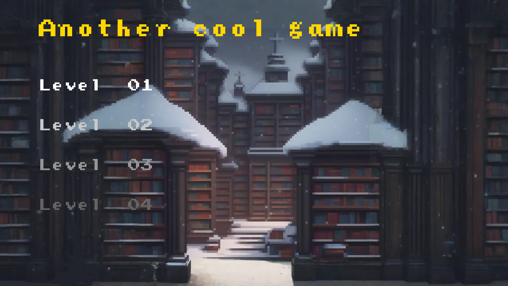
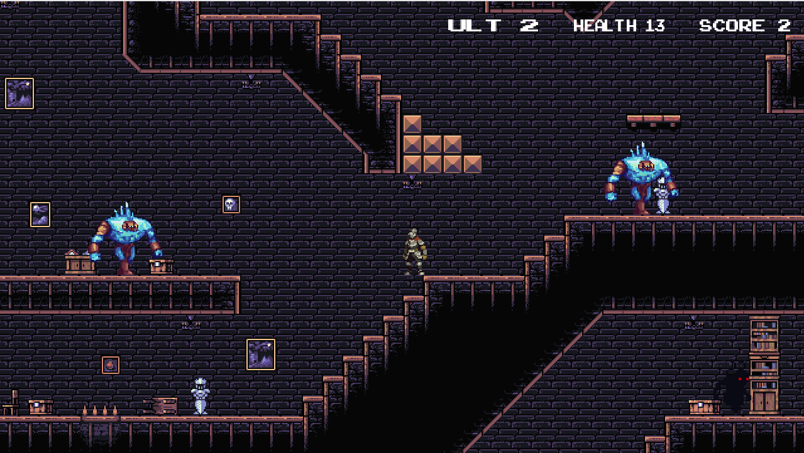
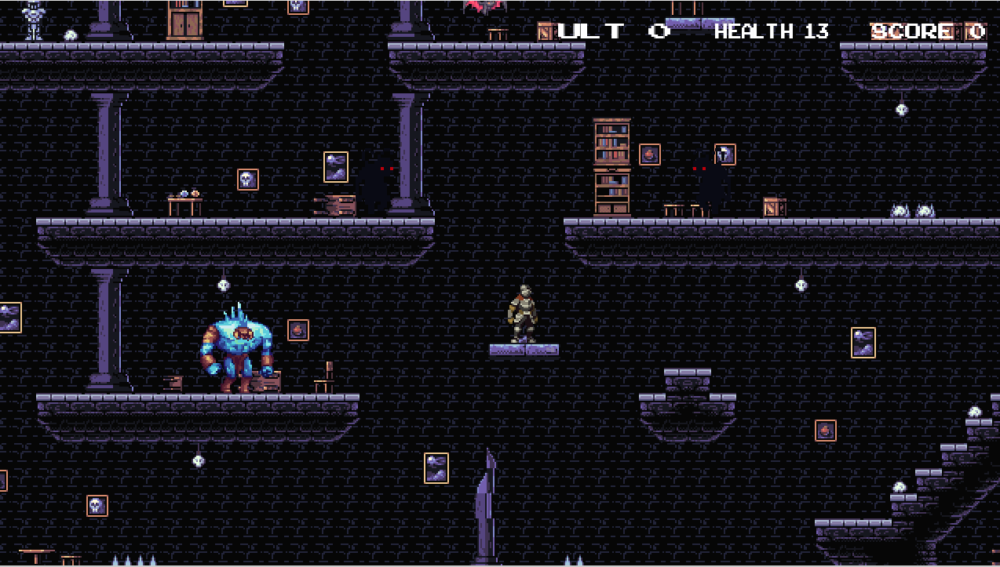
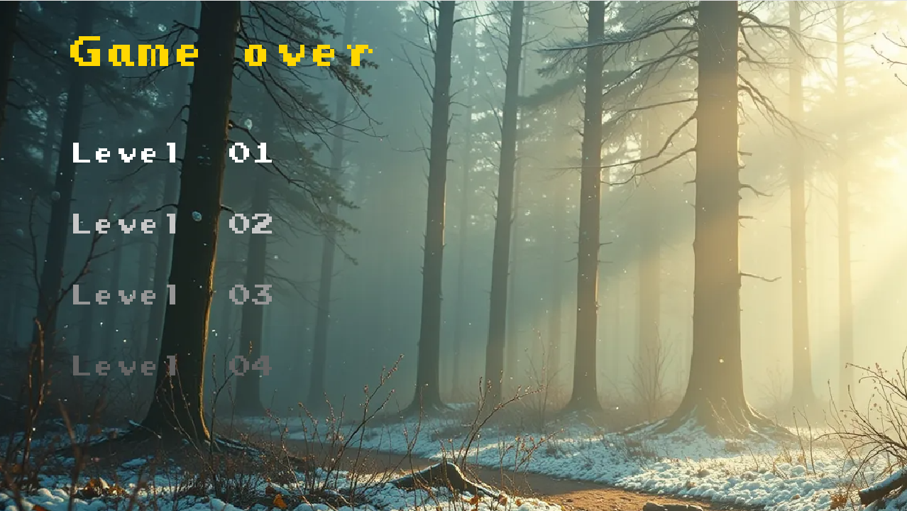
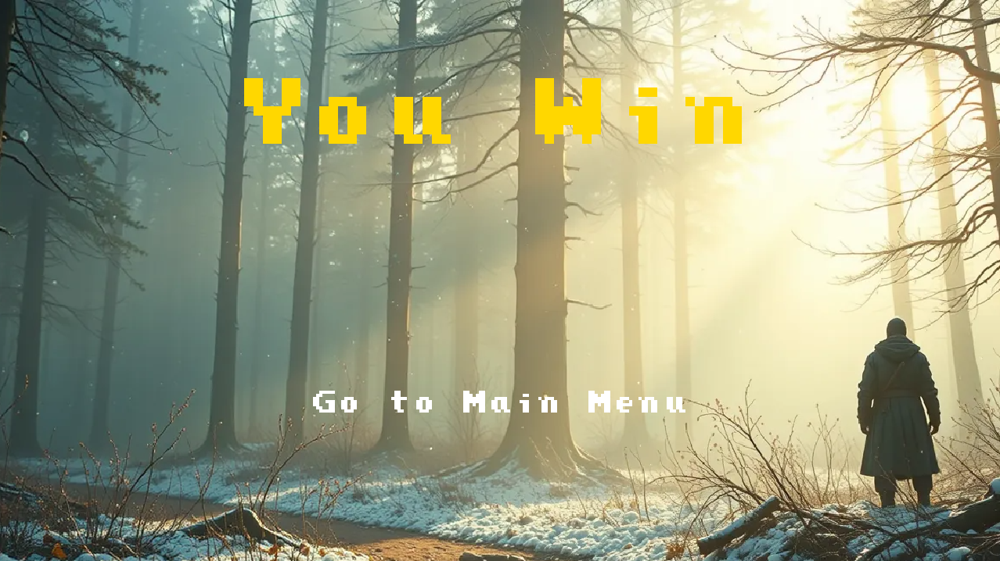

# Creación de Videojuegos - De Astra Ad Terra

## Entrega

Fecha de entrega: 27 de octubre de 2024

## Descripción del juego

Es un juego de ciencia ficción en el que el jugador controla una nave espacial que debe esquivar asteroides y naves enemigas, mientras dispara a enemigos.
El juego cuenta con :

- un menú principal
- cuatro niveles
- una pantalla de "muerte" donde llega el jugador si se muere que permite redirrecionar a los cuatro niveles
- una pantalla de "congratulation" que permite redirrecionar al menu principal
  El juego cuenta con música de fondo y assets de itch.io.

## Controles

- A: Mueve al jugador a la izquierda
- D: Mueve al jugador a la derecha
- Espacio: Saltar
- Esc: Salir del juego
- E: Disparar
- Q: Disparar el power up shoot
- P: Pausar el juego

## Historia del juego

El portador del invierno

Un mundo sombrío y en ruinas envuelto en un eterno hielo, devastado por la hechicería y la desesperación. La última esperanza de la tierra yace dentro del calabozo congelado del Señor Oscuro, donde una magia prohibida encierra al mundo en un invierno eterno.

Juegas como Sir Fort, un caballero de los moribundos guardianes del invierno, y desentrañas la verdad del Portador del Invierno, un poderoso hechicero cuyos una vez nobles esfuerzos por salvar el mundo se torcieron en su ruina eterna.

A través de niveles alternos como el caballero la historia se desarrolla.

Nivel 1: El Fuerte Helado

Sir Fort lucha a través de los bordes exteriores del calabozo, aprendiendo mecánicas básicas como el combate y la exploración. Enemigos corrompidos por la escarcha obstruyen el camino, insinuando la verdadera naturaleza de la maldición.

Nivel 2: El Salón de las Sombras Congeladas
Sir Fort explora más profundamente en el calabozo, descubriendo pistas de que el Portador podría no ser un verdadero villano. Trampas y enemigos más duros aparecen, poniendo a prueba la habilidad del jugador. Para ayudarlo en su búsqueda, ahora puede usar el ataque básico del hechicero.

Nivel 3: El Santuario Helado

Sir Fort llega al santuario, enfrentando a enemigos poderosos que parecen proteger al Portador del Invierno. El calabozo revela sus secretos finales: el portador del Invierno no fue la fuente de la escarcha sino su prisión, usando su poder para evitar que una tormenta catastrófica consumiera el mundo.

Final: La Última Habitación

En la habitación final, Sir Fort descubre al Portador del Invierno, débil y prisionero de entidades corrompidas por la escarcha. Los enemigos han convertido al hechicero en la fuente interminable de su poder. Fort debe derrotar a estos enemigos para liberar al portador.

## Objetivos del juego

Para ir avanzando en el juego, el jugador debe:

- Buscar la puerta de salida en cada nivel sin morir para avanzar al siguiente nivel
- Destruir a los enemigos para obtener puntos y poder obtener el power up shoot
- Matar al final boss para ganar el juego

## 4 enemigos

En mi juego hay 4 enemigos:

- Murciélagos: Son enemigos voladores que se mueven de arriba a bajo, tienen 1 de vida y 1 de daño
- Sombras: Son enemigos que se mueven de izquierda a derecha, tienen 1 de vida y 1 de daño
- Gigante de Hielo: Es un enemigo que se mueve de izquierda a derecha, tiene 3 de vida y 1 de daño
- Boss: Es un enemigo que se mueve de izquierda a derecha, tiene 20 de vida y 1 de daño

## Guía de uso

Para compilar el programa, ejecute el siguiente comando:

```bash
make clean; make; make run
```

El proyecto fue desarrollado en Ubuntu 24.04 en WSL2, utilizando el compilador g++ 13.2.0

El makefile para funcionar con mi arquitectura de carpeta fue modificado.

## Proceso de desarrollo

Para desarrollar el juego se uso el motor hecho en clase, el desarrollo se llevo a cabo siguiendo los videos disponibles en la plataforma, y agregando poco a poco las funcionalidades requeridas por la tarea.

Los principales cambios realizados en el motor fueron los siguientes:

- Se agrego un audio manager para reproducir música de fondo y efectos de sonido
- Se agregaron nuevos lua bindings para poder cargar y reproducir música y efectos de sonido
- Se arreglaron varios bugs en el motor, como el bug que no borraba los entities y components al cambiar de escena, lo cual llevaba a tener nuevos entities con componentes de la escena anterior
- Los niveles fueron creados utilizando Tiled, y se crearon scripts en lua para cargar los niveles y los assets necesarios
- Se agregaron nuevos componentes y sistemas para manejar la lógica de los enemigos y del jugador

Adjunto se agrego una serie de screenshots del juego ejecutandose:








## Instalación de las bibliotecas necesarias

Para instalar las bibliotecas necesarias en linux, ejecute el siguiente comando:

```bash
sudo apt install libsdl2-dev libsdl2-image-dev libsdl2-ttf-dev libsdl2-mixer-dev lua5.3 liblua5.3-dev libtinyxml2-dev
```

## Puntos extras

Para obtener puntos extras, implemente las siguientes características:

- [x] Se implemento el audio manager para reproducir música de fondo y efectos de sonido, ademas se usaron audios hechos propios por [Namlin] (https://github.com/namlin)
- [x] Todos los assets graficos, salvo las fuentes y el background fueron hechos por mi usando el programa [GIMP](https://www.gimp.org/)

## UML del motor de videojuegos

```mermaid
classDiagram

    class Game {
        -SDL_Window* window
        -bool isRunning
        -uint32_t mPreviousFrame
        -bool isPaused
        -bool is_debug_mode_activated
        -SDLManager& sdl_manager

        +SDL_Rect camera
        +int map_height
        +int map_width
        +int player_score
        +const int WINDOW_WIDTH
        +const int WINDOW_HEIGHT
        +SDL_Renderer* renderer
        +std::unique_ptr~Registry~ registry
        +std::unique_ptr~SceneManager~ scene_manager
        +std::unique_ptr~AssetsManager~ assets_manager
        +std::unique_ptr~EventManager~ events_manager
        +std::unique_ptr~ControllerManager~ controller_manager
        +std::unique_ptr~AudioManager~ audio_manager
        +std::unique_ptr~AnimationManager~ animation_manager
        +sol::state lua
        +std::vector~std::unique_ptr<SDL_GameController, decltype(controllerDeleter)>~ controllers

        -Game()
        -~Game()
        -void processInput()
        -void update()
        -void render()
        -void setup()
        -void run_scene()

        +void init()
        +void run()
        +void destroy()
        +void print_game_data()
        +static Game& get_instance()
    }
    class SceneManager {
        -std::map~string, string~ scenes
        -string next_scene
        -bool is_scene_running = false
        -std::unique_ptr~SceneLoader~ scene_loader

        +SceneManager()
        +~SceneManager()

        +void load_scene_from_script(string scene_path, sol::state lua)
        +void load_scene()
        +string get_next_scene() const
        +void set_next_scene(string next_scene)
        +bool is_current_scene_running() const
        +void start_scene()
        +void stop_scene()
    }
    class AssetsManager {
        -textures: std::map<std::string, SDL_Texture*>
        -fonts: std::map<std::string, TTF_Font*>
        +AssetsManager()
        +~AssetsManager()
        +clear_assets()
        +add_texture(SDL_Renderer*, std::string, std::string)
        +get_texture(std::string): SDL_Texture*
        +add_font(std::string, std::string, int)
        +get_font(std::string): TTF_Font*
    }
    class EventManager {
        -subscribers: std::map<std::type_index, std::unique_ptr<handler_list>>
        +EventManager()
        +~EventManager()
        +reset()
        +subscribe_to_event<TEvent, TOwner>(TOwner*, void (TOwner::*)(TEvent&))
        +emit_event<TEvent, TArgs>(TArgs...)
    }

    class ControllerManager {
        -action_key_name: std::map<std::string, int>
        -key_state: std::map<int, bool>
        -mouse_buttons_name: std::map<std::string, int>
        -mouse_button_state: std::map<int, bool>
        -mouse_position_x: int
        -mouse_position_y: int
        +ControllerManager()
        +~ControllerManager()
        +clear()
        +add_key(std::string, int)
        +is_key_pressed(std::string): bool
        +update_key(std::string, bool)
        +update_key(int, bool)
        +set_key_to_pressed(int)
        +set_key_to_pressed(std::string)
        +set_key_to_up(int)
        +set_key_to_up(std::string)
        +add_mouse_button(std::string, int)
        +is_mouse_button_pressed(std::string): bool
        +update_mouse_button(int, bool)
        +set_mouse_position(int, int)
        +get_mouse_position(): std::tuple<int, int>
        +set_mouse_button_to_pressed(int)
        +set_mouse_button_to_up(int)
    }

    class StatsManager {
        -std::unordered_map~string, StatsComponent~ _tagToStat

        -StatsManager()
        +static StatsManager& GetInstance()

        +void AddStat(string tag, StatsComponent stat)
        +void AddStatsToEntity(Entity &entity)
        +void Clear()
        +std::optional~StatsComponent~ operator[](string tag) const
    }

    class AnimationManager {
        -map~string, AnimationData~ animations
        +AnimationManager()
        +~AnimationManager()
        +void add_animation(string animation_id, string texture_id, int width, int height, int num_frames, int frame_speed_rate, bool is_loop)
        +AnimationData get_animation(string animation_id)
    }

    class AudioManager {
        -music_tracks: std::map<std::string, Mix_Music*>
        -sound_effects: std::map<std::string, Mix_Chunk*>
        +AudioManager()
        +~AudioManager()
        +add_music(std::string, std::string)
        +get_music(std::string): Mix_Music*
        +add_sound_effect(std::string, std::string)
        +get_sound_effect(std::string): Mix_Chunk*
        +play_music(std::string, int)
        +play_sound_effect(std::string, int)
        +stop_music(std::string)
        +stop_sound_effect(std::string)
        +stop_all_sounds()
        +clear_audio()
    }

    class Registry {
        -componentsPools: std::vector<std::shared_ptr<IPool>>
        -entityComponentSignatures: std::vector<Signature>
        -systems: std::unordered_map<std::type_index, std::shared_ptr<System>>
        -entities_to_be_added: std::set<Entity>
        -entities_to_be_killed: std::set<Entity>
        -free_ids: std::deque<int>
        +num_entities: int
        +Registry()
        +~Registry()
        +update()
        +create_entity(): Entity
        +kill_entity(Entity)
        +add_component<TComponent, TArgs>(Entity, TArgs...)
        +remove_component<TComponent>(Entity)
        +has_component<TComponent>(Entity): bool
        +get_component<TComponent>(Entity): TComponent&
        +add_system<TSystem, TArgs>(TArgs...)
        +remove_system<TSystem>(Entity)
        +has_system<TSystem>(Entity): bool
        +get_system<TSystem>(): TSystem&
        +add_entity_to_system(Entity)
        +remove_entity_from_system(Entity)
        +clear_all_entities()
    }
     class Entity {
        -id: int
        -registry: Registry*
        +Entity(int)
        +~Entity()
        +get_id(): int
        +kill()
        +operator==(const Entity& other) const: bool
        +operator!=(const Entity& other) const: bool
        +operator>(const Entity& other) const: bool
        +operator<(const Entity& other) const: bool  

        +add_component<TComponent, TArgs>(TArgs...)
        +remove_component<TComponent>()
        +has_component<TComponent>(): bool
        +get_component<TComponent>(): TComponent&
    }

    class System {
        -componentSignature: Signature
        -entities: std::vector<Entity>
        +System()
        +~System()
        +add_entity_to_system(Entity)
        +remove_entity_from_system(Entity)
        +get_entities(): std::vector<Entity>
        +get_signature(): const Signature&
        +RequireComponent<TComponent>()
    }


    class Component {
        +get_id() int
    }

    class SceneLoader {
        -std::set~string~ tags_with_damage_colliders

        +SceneLoader()
        +~SceneLoader()

        -void load_sounds(sol::table sounds, std::unique_ptr~AudioManager~ audio_manager)
        -void load_music(sol::table music, std::unique_ptr~AudioManager~ audio_manager)
        -void load_sprites(SDL_Renderer* renderer, sol::table sprites, std::unique_ptr~AssetsManager~ asset_manager)
        -void load_fonts(sol::table fonts, std::unique_ptr~AssetsManager~ asset_manager)
        -void load_buttons(sol::table buttons, std::unique_ptr~ControllerManager~ controller_manager)
        -void load_keys_actions(sol::table keys, std::unique_ptr~ControllerManager~ controller_manager)
        -void load_entities(sol::state lua, sol::table entities, std::unique_ptr~Registry~ registry)
        -void load_entity(sol::state lua, Entity entity, sol::table entityTable)
        -void load_animations(sol::table animations, std::unique_ptr~AnimationManager~ animation_manager)
        -void LoadMap(sol::table map, std::unique_ptr~Registry~ registry, string script_path, sol::state lua)
        -void LoadLayer(std::unique_ptr~Registry~ registry, tinyxml2::XMLElement* layerElement, int tWidth, int tHeight, int mWidth, string tileSet, int columns)
        -void LoadColliders(std::unique_ptr~Registry~ registry, tinyxml2::XMLElement* objectGroup)
        -void load_enemy_colliders(std::unique_ptr~Registry~ registry, tinyxml2::XMLElement* objectGroup)
        -void load_enemies(Registry registry, string path, tinyxml2::XMLElement* objectGroup, sol::state lua)
        -void load_damage_colliders(sol::table colliders)
        -void load_stats(sol::table stats)

        +void load_scene(string scene_path, sol::state lua, std::unique_ptr~AssetsManager~ asset_manager,
            std::unique_ptr~ControllerManager~ controller_manager, std::unique_ptr~AudioManager~ audio_manager,
            std::unique_ptr~Registry~ registry, std::unique_ptr~AnimationManager~ animation_manager, SDL_Renderer* renderer)
    }


    SceneLoader "1" -- "1" SceneManager
    Game "1" -- "1" Registry
    Game "1" -- "1" SceneManager
    Game "1" -- "1" AssetsManager
    Game "1" -- "1" EventManager
    Game "1" -- "1" ControllerManager
    Game "1" -- "1" AudioManager
    Game "1" -- "1" AnimationManager
    Game "1" -- "1" Registry
    Registry "1" -- "*" Entity
    Registry "1" -- "*" System
    Entity "1" -- "0..*" Component
    System "*" -- "*" Entity

```

## Ressources used for the game

- [arcade classic font](https://www.1001fonts.com/arcadeclassic-font.html)
- [tileset de ruinas](https://bdragon1727.itch.io/platform-asset-part-4)
- [asset del knight](https://aamatniekss.itch.io/fantasy-knight-free-pixelart-animated-character)
- [asset del boss](https://zneeke.itch.io/dark-fantasy-big-boss-1)
- [asset de las sombras](https://zneeke.itch.io/dark-fantasy-monster-pack-1)
- [asset del gigante de hielo](https://chierit.itch.io/boss-frost-guardian)
- [asset de los murciélagos](https://zneeke.itch.io/dark-fantasy-monster-pack-1)
- Music made by game developer [Namlin](https://github.com/namlin)
- [dungeon tileset](https://raou.itch.io/dark-dun)
