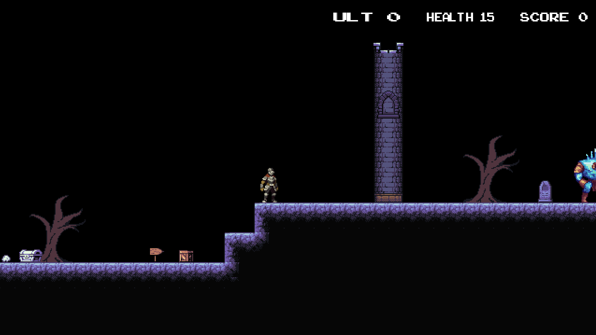

# Creación de Videojuegos - De Astra Ad Terra


## Entrega

Fecha de entrega: 8 de diciembre de 2024

## Descripción del juego

Es un juego de ciencia ficción en el que el jugador controla a un caballero que debe enfrentarse a enemigos en un mundo de invierno eterno.
El juego cuenta con :

- un menú principal
- cuatro niveles
- una pantalla de "muerte" donde llega el jugador si se muere que permite redirrecionar a los cuatro niveles
- una pantalla de "congratulation" que permite redirrecionar al menu principal
  El juego cuenta con música de fondo y assets de itch.io.

## Controles

- A: Mueve al jugador a la izquierda
- D: Mueve al jugador a la derecha
- Espacio: Saltar
- Esc: Salir del juego
- E: Disparar
- Q: Disparar el power up shoot
- P: Pausar el juego

## Historia del juego

El Portador del Invierno
Un mundo desolado y cubierto por un invierno eterno, donde una fuerza oscura ha transformado un castillo ancestral en la fuente de la maldición que consume la tierra. Sir Fort, el último caballero de los Guardianes del Invierno, emprende una misión desesperada para enfrentar el origen del hielo eterno y restaurar la esperanza.

Nivel 1: Las Afueras del Castillo
Sir Fort atraviesa las gélidas tierras que rodean el castillo, enfrentándose a sombras pequeñas y bandadas de murciélagos que atacan desde el aire. Entre ruinas cubiertas de nieve, descubre que las criaturas parecen emanar del interior del castillo. Este nivel introduce mecánicas básicas de combate y exploración, como el manejo de su espada y el uso estratégico de su escudo para repeler ataques.

Nivel 2: Los Pasillos del Castillo
Dentro del castillo, Sir Fort recorre oscuros y fríos pasillos llenos de trampas y enemigos más desafiantes, como sombras más ágiles y murciélagos que atacan en oleadas coordinadas. También encuentra gigantes de hielo, criaturas imponentes que requieren precisión y estrategia para derrotar. Este nivel prueba las habilidades avanzadas del jugador y presenta objetos ocultos que ofrecen pistas sobre la maldición.

Nivel 3: El Calabozo Profundo
En lo más profundo del castillo, Fort explora un lúgubre calabozo lleno de ecos de sufrimiento. Los gigantes de hielo se vuelven más frecuentes, y las sombras pequeñas atacan en grupos, haciendo del combate una prueba de resistencia. Aquí, Sir Fort encuentra fragmentos de escritos antiguos que revelan que una sombra gigantesca surgió tras un antiguo ritual que salió mal, transformando al castillo y a sus habitantes en instrumentos de la oscuridad.

Nivel 4: El Corazón del Invierno
En la sala central del castillo, Fort finalmente se enfrenta a la sombra titánica, una colosal manifestación del poder oscuro que trajo el invierno eterno. La batalla final es feroz, con la sombra utilizando ataques devastadores y el entorno helado en su favor. Con ingenio y valentía, Fort logra derrotarla, rompiendo la maldición y permitiendo que el sol vuelva a brillar en el mundo.

## Objetivos del juego

Para ir avanzando en el juego, el jugador debe:

- Buscar la puerta de salida en cada nivel sin morir para avanzar al siguiente nivel
- Destruir a los enemigos para obtener puntos y poder obtener el power up shoot
- Matar al final boss para ganar el juego

## 4 enemigos

En mi juego hay 4 enemigos:

- Murciélagos: Son enemigos voladores que se mueven de arriba a bajo, tienen 1 de vida y 1 de daño
- Sombras: Son enemigos que se mueven de izquierda a derecha, tienen 1 de vida y 1 de daño
- Gigante de Hielo: Es un enemigo que se mueve de izquierda a derecha, tiene 3 de vida y 1 de daño
- Boss: Es un enemigo que se mueve de izquierda a derecha, tiene 20 de vida y 1 de daño

## Guía de uso

Para compilar el programa, ejecute el siguiente comando:

```bash
make clean; make; make run
```

El proyecto fue desarrollado en Ubuntu 24.04 en WSL2, utilizando el compilador g++ 13.2.0

El makefile para funcionar con mi arquitectura de carpeta fue modificado.

## Proceso de desarrollo

Para desarrollar el juego se uso el motor hecho en clase, el desarrollo se llevo a cabo siguiendo los videos disponibles en la plataforma, y agregando poco a poco las funcionalidades requeridas por la tarea.

Los principales cambios realizados en el motor fueron los siguientes:

- Se agrego un audio manager para reproducir música de fondo y efectos de sonido
- Se agregaron nuevos lua bindings para poder cargar y reproducir música y efectos de sonido
- Se arreglaron varios bugs en el motor, como el bug que no borraba los entities y components al cambiar de escena, lo cual llevaba a tener nuevos entities con componentes de la escena anterior
- Los niveles fueron creados utilizando Tiled, y se crearon scripts en lua para cargar los niveles y los assets necesarios
- Se agregaron nuevos componentes y sistemas para manejar la lógica de los enemigos y del jugador

Adjunto se agrego una serie de screenshots del juego ejecutandose:




## Instalación de las bibliotecas necesarias

Para instalar las bibliotecas necesarias en linux, ejecute el siguiente comando:

```bash
sudo apt install libsdl2-dev libsdl2-image-dev libsdl2-ttf-dev libsdl2-mixer-dev lua5.3 liblua5.3-dev libtinyxml2-dev
```

## Puntos extras

Para obtener puntos extras, implemente las siguientes características:

- [x] Se implemento el audio manager para reproducir música de fondo y efectos de sonido, ademas se usaron audios hechos propios por [Namlin] (https://github.com/namlin)
- [x] Se implementó el uso de mandos para controlar al jugador

## UML del motor de videojuegos


## Ressources used for the game

- [arcade classic font](https://www.1001fonts.com/arcadeclassic-font.html)
- [tileset de ruinas](https://bdragon1727.itch.io/platform-asset-part-4)
- [asset del knight](https://aamatniekss.itch.io/fantasy-knight-free-pixelart-animated-character)
- [asset del boss](https://zneeke.itch.io/dark-fantasy-big-boss-1)
- [asset de las sombras](https://zneeke.itch.io/dark-fantasy-monster-pack-1)
- [asset del gigante de hielo](https://chierit.itch.io/boss-frost-guardian)
- [asset de los murciélagos](https://zneeke.itch.io/dark-fantasy-monster-pack-1)
- [asset del power up shoot](https://gamedeveloperstudio.itch.io/snowball)
- Music made by game developer [Namlin](https://github.com/namlin)
- [dungeon tileset](https://raou.itch.io/dark-dun)
